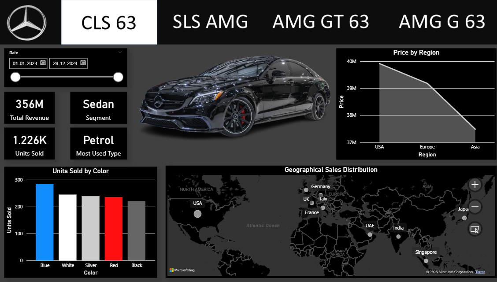
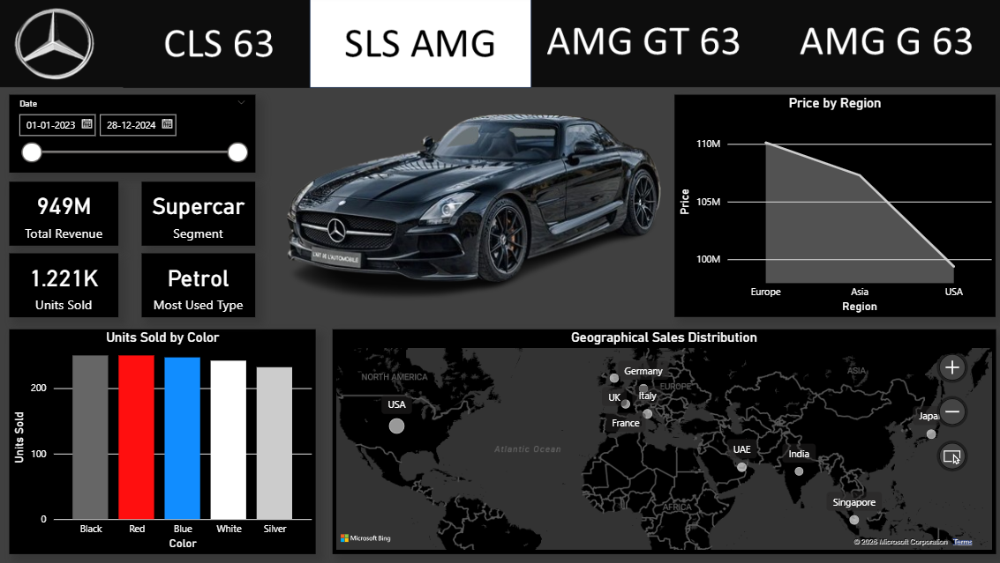
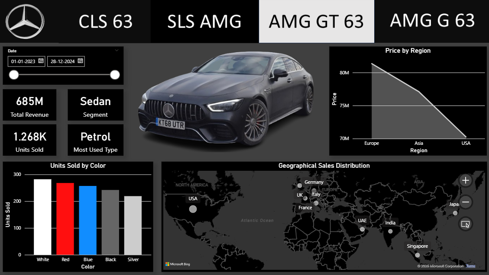
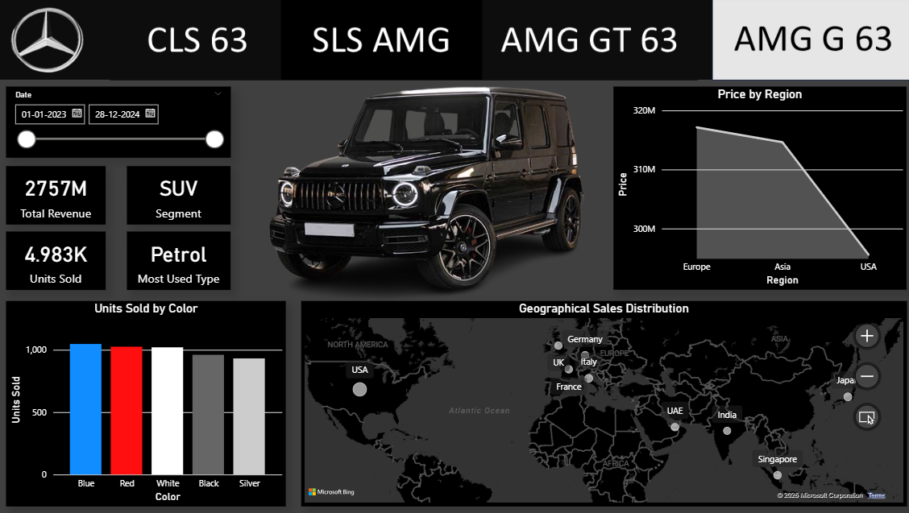

🚗 Mercedes Sales Dashboard (Power BI)

📊 Project Overview

This project presents a **fully interactive Power BI dashboard** built to analyze Mercedes-Benz sales performance across multiple luxury models.

The dashboard is designed with a **multi-page architecture**, where each page represents a specific car model:

* CLS 63
* SLS AMG
* AMG GT 63
* AMG G 63

Each page is dynamically filtered using **page-level filters**, ensuring that all KPIs and visualizations display data specific to the selected model.

The primary goal of this project is to combine **data analysis, business insights, and premium UI design** into a single, user-friendly dashboard.

🎯 Objectives

* Analyze sales performance across different Mercedes models
* Identify regional sales trends
* Understand customer preferences (fuel type, color, segment)
* Build a visually appealing and interactive dashboard
* Demonstrate Power BI, DAX, and data storytelling skills

🧹 Data Preparation & Cleaning

To ensure accuracy and consistency, the dataset underwent the following transformations:

* Removed inconsistencies and standardized categorical values
* Corrected segment classifications:

  * Sedan
  * SUV
  * Supercar
* Verified relationships between model and segment
* Created calculated fields such as Revenue
* Ensured proper formatting for dates, regions, and numerical values

🛠️ Tools & Technologies

* **Power BI Desktop**
* **DAX (Data Analysis Expressions)**
* **Excel / CSV Dataset**
* **Data Cleaning & Transformation**
* **Data Visualization & UI Design**

📊 Dashboard Structure

The dashboard is divided into **four dedicated pages**, each focusing on a specific Mercedes model.

🚘 CLS 63 — Sedan Segment Analysis

This page provides insights into the CLS 63 model, focusing on sedan performance.

Key Highlights:

* Total Revenue and Units Sold
* Regional sales distribution
* Color preferences
* Customer fuel type trends

📸 Dashboard Preview:

---

🏎️ SLS AMG — Supercar Performance

This page highlights the performance of a high-end supercar segment.

Key Highlights:

* High-value revenue analysis
* Premium segment insights
* Regional contribution comparison

📸 Dashboard Preview:

🚗 AMG GT 63 — Luxury Sedan Insights

This page focuses on luxury sedan performance with balanced global demand.

Key Highlights:

* Revenue trends across regions
* Units sold distribution
* Customer preferences

📸 Dashboard Preview:

🚙 AMG G 63 — SUV Performance Analysis

This page analyzes the SUV segment, known for strong global demand.

Key Highlights:

* SUV segment dominance
* High demand across multiple regions
* Strong revenue contribution

📸 Dashboard Preview:

📈 Key Visualizations

The dashboard includes the following visual components:

* KPI Cards

  * Total Revenue
  * Units Sold
  * Segment
  * Most Used Fuel Type

* Line Chart

  * Revenue by Region

* Bar Chart

  * Units Sold by Color

* Map Visualization

  * Units Sold by Country

📌 Key Insights

* SUV segment (AMG G 63) shows strong global demand
* Petrol is the most commonly used fuel type
* Europe and USA contribute significantly to revenue
* Sales performance varies across models and regions
* Color preferences influence purchase behavior

🎨 Dashboard Design

The dashboard follows a premium dark theme inspired by Mercedes-Benz branding, featuring:

* Minimalistic black and white color palette
* Consistent layout across all pages
* Clean navigation bar for model selection
* Balanced spacing and visual hierarchy

🚀 How to Use

1. Download the `.pbix` file from this repository
2. Open it using Power BI Desktop
3. Navigate between pages using the top menu
4. Interact with charts and visuals to explore insights

🙌 Author

Vishnu A Nambiar

## 🙌 Author

**Vishnu A Nambiar**

